# Phase 1 - EDA

## Dataset summary
| item | value |
| --- | --- |
| rows | 7043 |
| cols | 21 |
| duplicate rows | 0 |
| duplicate customerID | 0 |
| blank TotalCharges (as string) | 11 |
| churn rate (Yes) | 0.265 |

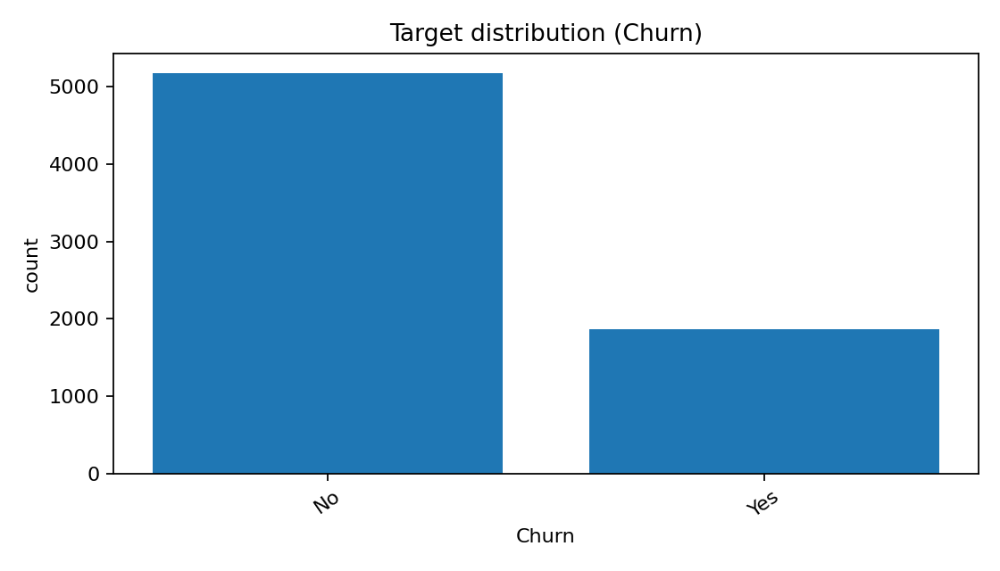

## Column types
| dtype | count |
| --- | --- |
| object | 18 |
| int64 | 2 |
| float64 | 1 |

## Missing values
- No explicit NaN values were found, but `TotalCharges` contains blank strings in the raw CSV.

## Numeric features
| feature | count | mean | std | min | 25% | 50% | 75% | max | missing |
| --- | --- | --- | --- | --- | --- | --- | --- | --- | --- |
| SeniorCitizen | 7043.0 | 0.162 | 0.369 | 0.0 | 0.0 | 0.0 | 0.0 | 1.0 | 0 |
| tenure | 7043.0 | 32.371 | 24.559 | 0.0 | 9.0 | 29.0 | 55.0 | 72.0 | 0 |
| MonthlyCharges | 7043.0 | 64.762 | 30.09 | 18.25 | 35.5 | 70.35 | 89.85 | 118.75 | 0 |
| TotalCharges_num | 7032.0 | 2283.3 | 2266.771 | 18.8 | 401.45 | 1397.475 | 3794.738 | 8684.8 | 11 |

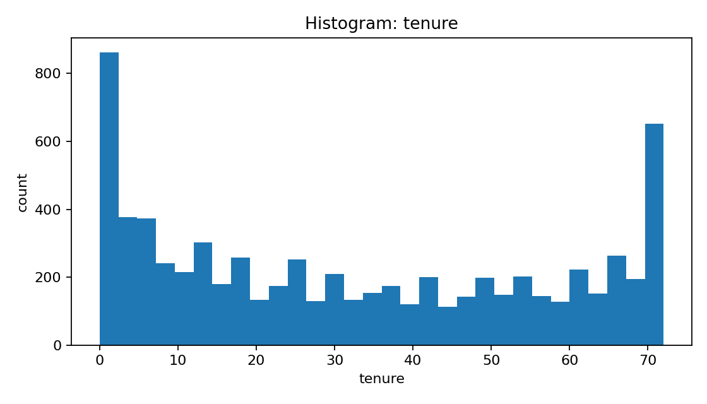

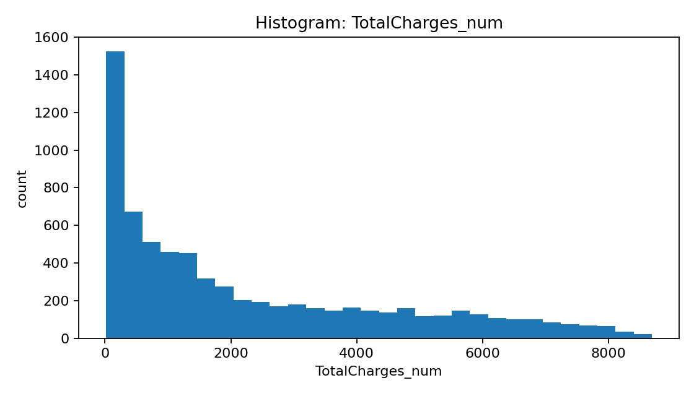

## Numeric correlation
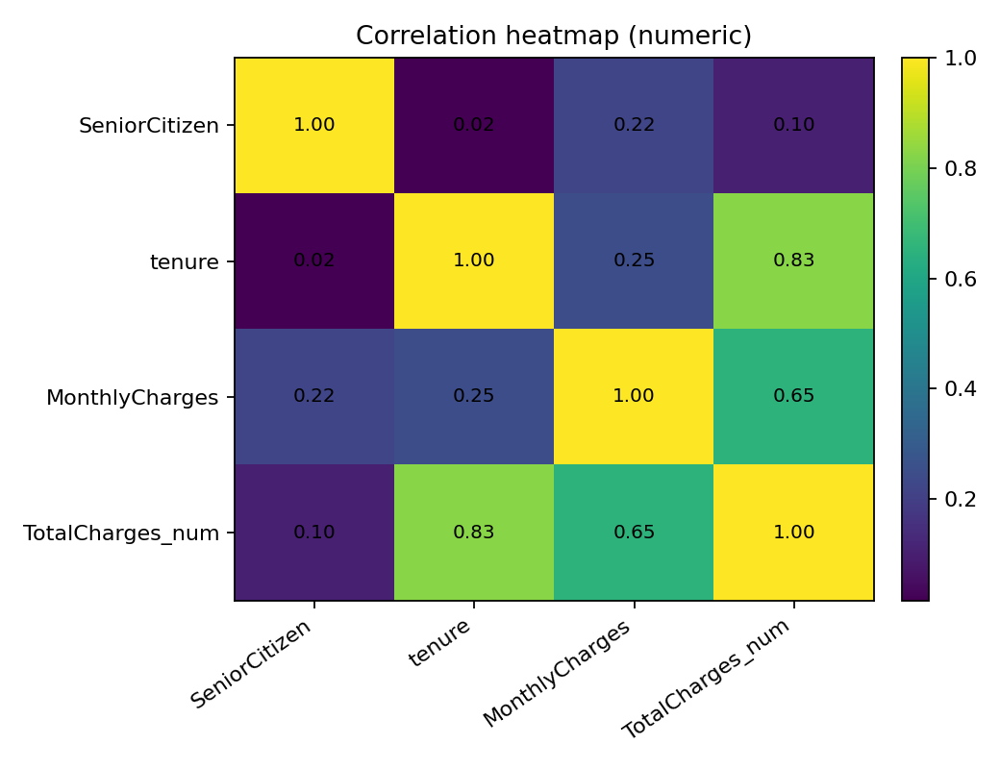

## Numeric vs target
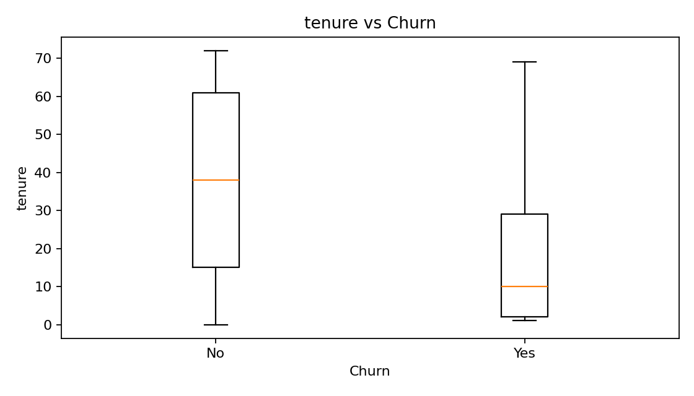

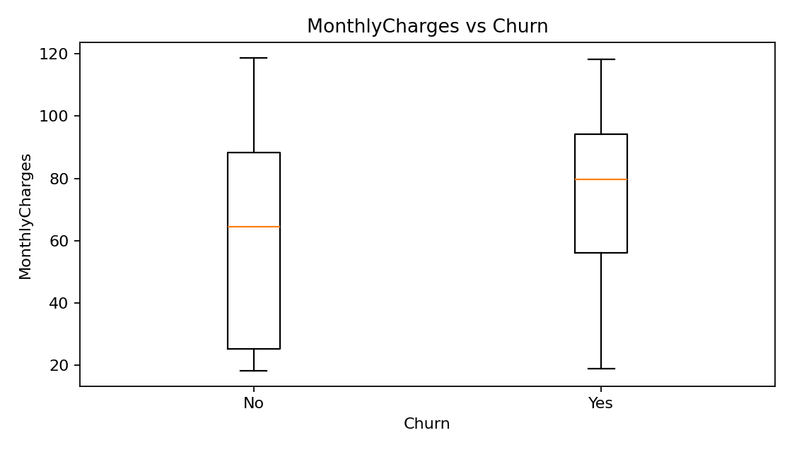

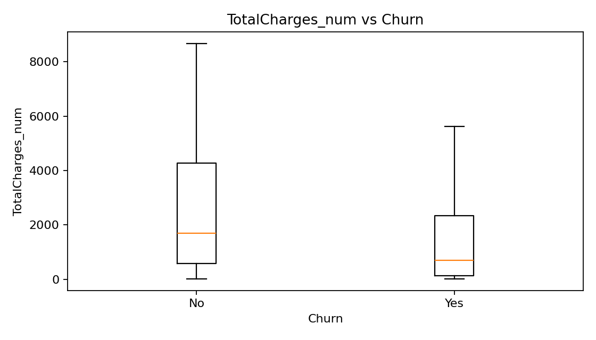

## Churn rate by key categorical features
### Contract
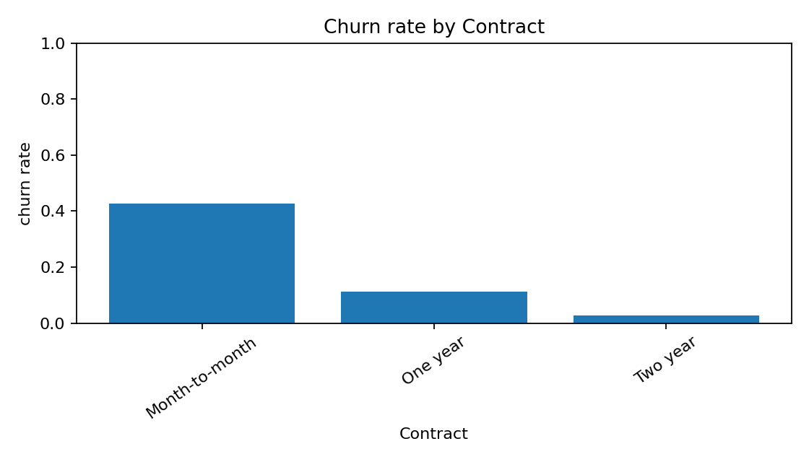

| Contract | churn_rate |
| --- | --- |
| Month-to-month | 0.4271 |
| One year | 0.1127 |
| Two year | 0.0283 |

### InternetService
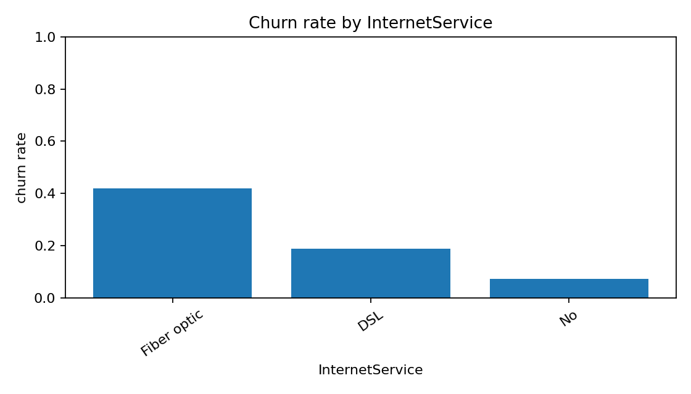

| InternetService | churn_rate |
| --- | --- |
| Fiber optic | 0.4189 |
| DSL | 0.1896 |
| No | 0.074 |

### PaymentMethod
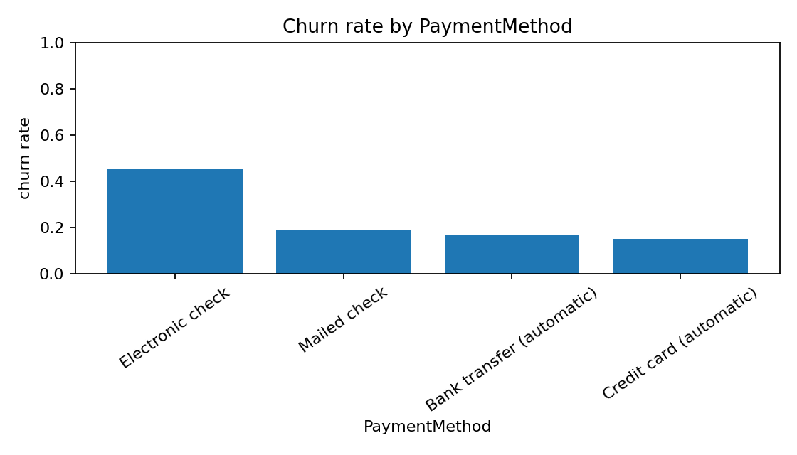

| PaymentMethod | churn_rate |
| --- | --- |
| Electronic check | 0.4529 |
| Mailed check | 0.1911 |
| Bank transfer (automatic) | 0.1671 |
| Credit card (automatic) | 0.1524 |

### OnlineSecurity

| OnlineSecurity | churn_rate |
| --- | --- |
| No | 0.4177 |
| Yes | 0.1461 |
| No internet service | 0.074 |

### TechSupport

| TechSupport | churn_rate |
| --- | --- |
| No | 0.4164 |
| Yes | 0.1517 |
| No internet service | 0.074 |

### PaperlessBilling
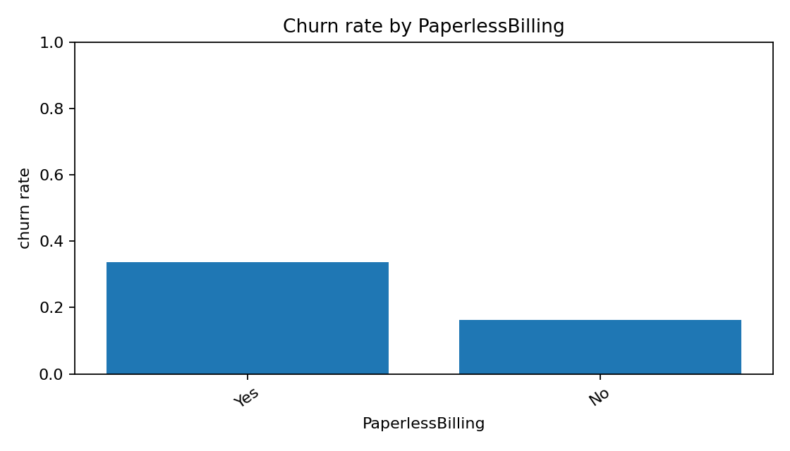

| PaperlessBilling | churn_rate |
| --- | --- |
| Yes | 0.3357 |
| No | 0.1633 |

## Quick notes
- Higher churn: Month-to-month (~42.7%)
- Lower churn: Two year (~2.8%)
- Fiber optic has higher churn risk (~41.9%)
- Payment method Electronic check shows higher churn (~45.3%)
- Median tenure: churn=Yes -> 10, churn=No -> 38
- Median MonthlyCharges: churn=Yes -> 79.65, churn=No -> 64.43